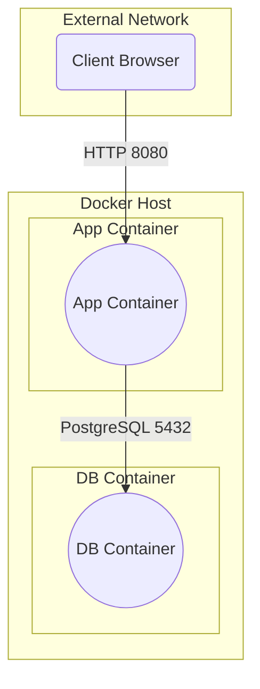

# Running Cascade with Docker

## Download the Cascade Docker toolkit

### Using git
```shell
git clone https://github.com/Cascade-Lab/cascade-docker.git
cd cascade-docker/
```

### Or using wget

```shell
wget https://github.com/Cascade-Lab/cascade-docker/archive/refs/heads/master.zip
unzip master.zip
cd cascade-docker/
```
## Install docker and docker compose if now yet installed

Courtesy scripts for Ubuntu and Debian are provided in the support folder. Please refer to the official Docker documentation for installation instructions for your platform.
https://docs.docker.com/engine/install/


```shell
chmod +x support/docker-install-ubuntu.sh
./support/docker-install-ubuntu.sh
```

## Log into the Cascade Container Registry

```shell
docker login -u USER -p PASSWORD cascadelab.azurecr.io
```

Note: USER and PASSWORD are provided by Cascade client care.

https://docs.docker.com/engine/reference/commandline/login/#credentials-store

## Customize Password

Open the 'db_password.txt' file and update the password to your desired one

## Secure Password

Make sure you are in the cascade-docker folder.

```shell
chmod 600 db_password.txt
```
After running this command, the file will have permissions set to 600, granting read and write access only to the file owner while denying access to other users.

## Creating Database and Attachment Folders

Step 1: Create Necessary Folders
Ensure you are within the cascade-docker folder and execute the following command in your terminal:

```shell
mkdir -p data/db data/documents
```
After running this command:

The data/db and data/documents directories will be created within your cascade-docker folder.

Step 2: Find Your Username
Retrieve your username by running the following command in the terminal:

```shell
echo $HOME
```
The output will display the path to your home directory, which typically corresponds to your username.


Step 3: Update Docker Compose Configuration
In your **docker-compose.yaml** file, update the volume paths by replacing USER with your actual username:

```docker-compose.yaml
volumes:
  db-data:
    driver_opts:
      type: none
      o: bind
      device: /home/<USER>/cascade-docker/data/db
  app-data:
    driver_opts:
      type: none
      o: bind
      device: /home/<USER>/cascade-docker/data/documents
```

Ensure that /home/USER/cascade-docker reflects the correct path to your cascade-docker directory.

## Start Cascade

Make sure you are in the cascade-docker folder.

```shell
docker compose up
```

## Opening external access

The application can be connected to two domains and their subdomains, which should be available 
from your infrastructure in case of usage:
* neterium.cloud (Name screening API - Neterium)
* sentry.io (Error tracking - Sentry. Optional)


## Stop Cascade

```shell
docker compose down
```

## Backup Cascade

The **data** folder is what you need to backup

it is located in cascade-docker directory
